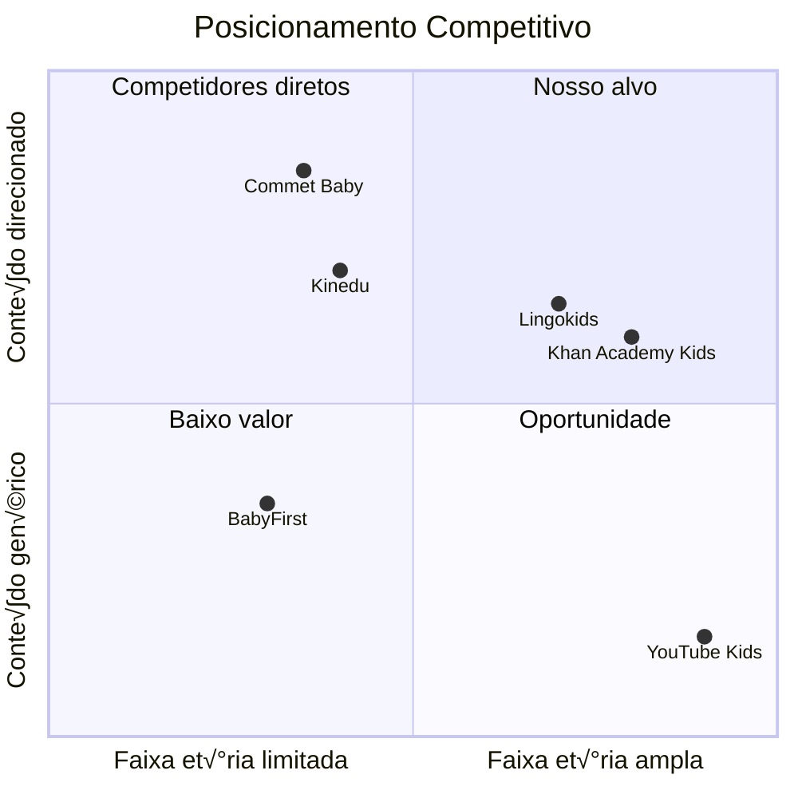
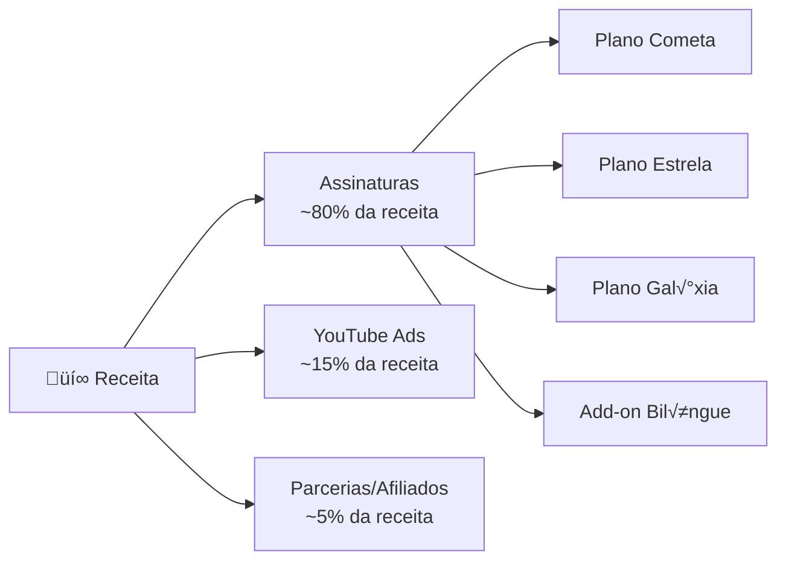
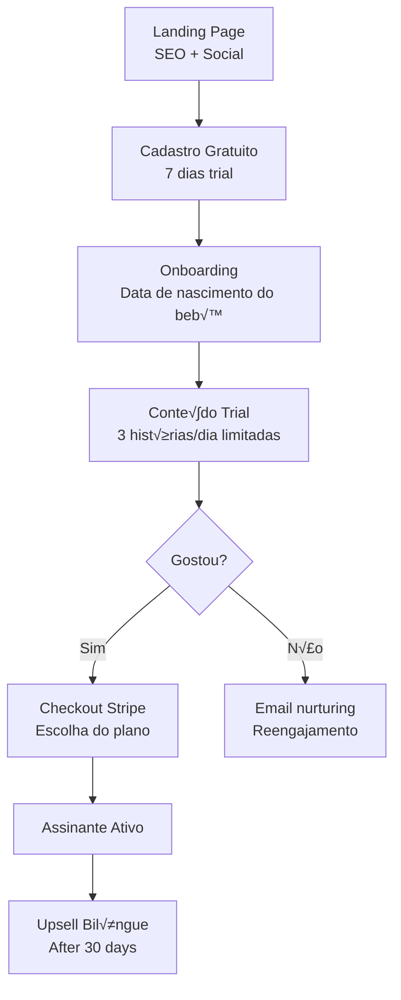
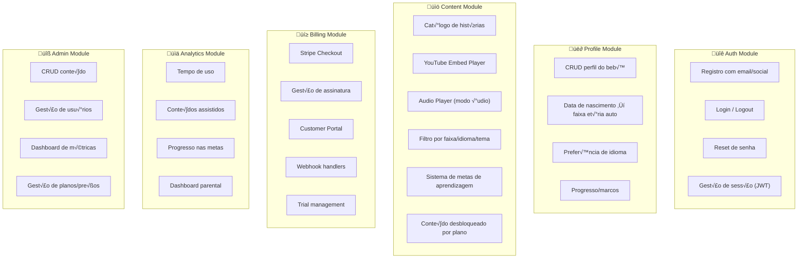
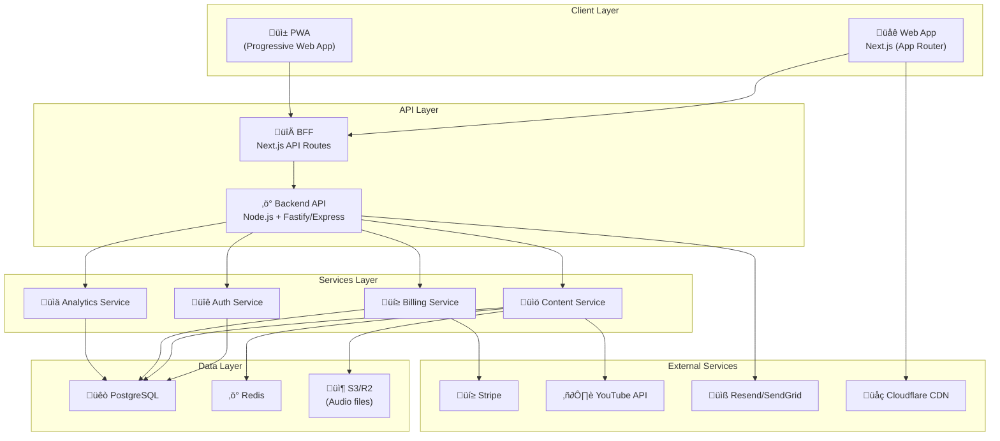
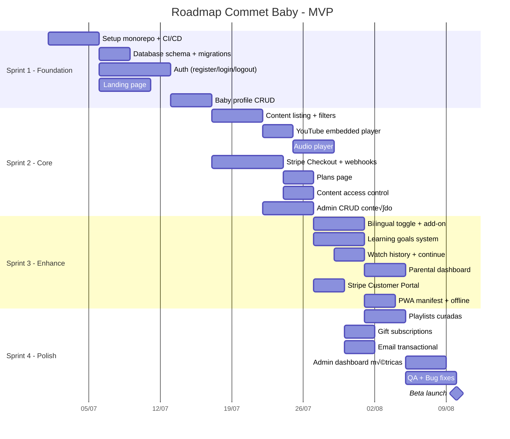

# 🍼 Commet Baby — Idealização, Modelo de Negócio & Requisitos

> Plataforma de entretenimento e educação infantil para bebês de 0 a 3 anos, com conteúdo bilíngue e metas de aprendizagem.

---

## 1. Vis√£o do Produto

### 1.1 Proposta de Valor

**"Conte√∫do direcionado que transforma tempo de tela em tempo de aprendizagem."**

Commet Baby é uma plataforma de streaming educacional para bebês de RN até 3 anos, que oferece histórias, músicas e vídeos com metas de aprendizagem por faixa etária, opção bilíngue (PT-BR / EN), e monetização dual (assinaturas + YouTube Ads).

### 1.2 Diferencial Competitivo

| Aspecto | Commet Baby | Concorrentes |
|---|---|---|
| **Faixa etária** | 0-3 anos (inclui RN) | Maioria começa em 2+ anos |
| **Bilíngue como add-on** | PT-BR ↔ EN modular | Fixo ou inexistente |
| **Metas de aprendizagem** | Rastreamento por marco de desenvolvimento | Conteúdo genérico |
| **Dual revenue** | Assinatura + YouTube Ads | Apenas um modelo |
| **Modo áudio** | Reprodução em background | Raro nessa faixa |
| **Direcionamento científico** | Conteúdo validado por faixa etária | Curadoria genérica |

### 1.3 An√°lise de Mercado



**Gap de mercado identificado:** A maioria das plataformas começa em 2+ anos. O segmento de 0-12 meses é pouco explorado digitalmente, especialmente com conteúdo bilíngue direcionado.

---

## 2. Modelo de Negócio

### 2.1 Streams de Receita



### 2.2 Planos de Assinatura

> [!IMPORTANT]
> A validação do modelo de negócio é por faixa etária. Cada plano dá acesso ao conteúdo da faixa correspondente. O plano Galáxia é o "all-access" para todas as faixas.

| Plano | Faixa Et√°ria | Mensal (BRL) | Anual (BRL) | O que inclui |
|---|---|---|---|---|
| 🌟 **Cometa** | 0–12 meses | R$ 19,90 | R$ 189,90 (~20% off) | Conteúdo 0-12m, 1 perfil, modo áudio, PT-BR |
| ⭐ **Estrela** | 1–2 anos | R$ 24,90 | R$ 239,90 (~20% off) | Conteúdo 1-2a, 1 perfil, modo áudio, PT-BR |
| 🌌 **Galáxia** | 0–3 anos | R$ 34,90 | R$ 329,90 (~21% off) | Todo conteúdo, 3 perfis, modo áudio, PT-BR |
| 🌍 **Add-on Bilíngue** | Qualquer plano | +R$ 14,90/mês | +R$ 139,90/ano | Conteúdo em EN, toggle de idioma, pronúncia nativa |

### 2.3 Funil de Convers√£o



### 2.4 Métricas de Negócio (KPIs)

| Métrica | Target Mês 1-3 | Target Mês 6 | Target Mês 12 |
|---|---|---|---|
| **Usu√°rios registrados** | 500 | 3.000 | 15.000 |
| **Taxa de convers√£o trial ‚Üí pago** | 8% | 12% | 18% |
| **Churn mensal** | 15% | 10% | 7% |
| **ARPU** (Receita média por usuário) | R$ 22 | R$ 26 | R$ 30 |
| **MRR** (Receita recorrente mensal) | R$ 880 | R$ 9.360 | R$ 81.000 |
| **LTV** (Lifetime Value) | R$ 146 | R$ 260 | R$ 428 |

---

## 3. Personas & Jornadas

### 3.1 Personas

#### Persona 1: Mariana (M√£e de Primeira Viagem)
- **Idade:** 28 anos | **Bebê:** 4 meses
- **Dor:** "Não sei o que é conteúdo seguro para o meu bebê"
- **Desejo:** Conte√∫do curado, curto, que estimule sem superestimular
- **Plano ideal:** Cometa (0-12m) ‚Üí upgrade para Estrela quando crescer

#### Persona 2: Rafael (Pai Tech-Savvy)
- **Idade:** 33 anos | **Bebê:** 18 meses
- **Dor:** "Quero que meu filho aprenda inglês desde cedo"
- **Desejo:** Conteúdo bilíngue com pronúncia nativa
- **Plano ideal:** Estrela (1-2a) + Add-on Bilíngue

#### Persona 3: Avó Dona Teresa
- **Idade:** 62 anos | **Neto:** 2 anos
- **Dor:** "Preciso de algo seguro pra entreter enquanto cuido dele"
- **Desejo:** Interface simples, conte√∫do seguro, sem an√∫ncios invasivos
- **Plano ideal:** Gift subscription Gal√°xia

---

## 4. Requisitos Funcionais

### 4.1 Módulos do Sistema



### 4.2 Requisitos Detalhados por Módulo

#### 🔐 RF-AUTH: Autenticação & Autorização

| ID | Requisito | Prioridade | Sprint |
|---|---|---|---|
| RF-AUTH-01 | Registro com email + senha | P0 | Sprint 1 |
| RF-AUTH-02 | Login com email + senha | P0 | Sprint 1 |
| RF-AUTH-03 | Login social (Google, Apple) | P1 | Sprint 2 |
| RF-AUTH-04 | Recuperação de senha por email | P0 | Sprint 1 |
| RF-AUTH-05 | Refresh token com rotação | P0 | Sprint 1 |
| RF-AUTH-06 | Logout com invalidação de token | P0 | Sprint 1 |
| RF-AUTH-07 | Rate limiting em endpoints auth | P0 | Sprint 1 |
| RF-AUTH-08 | Verificação de email | P1 | Sprint 2 |

#### 👶 RF-PROFILE: Perfis de Bebê

| ID | Requisito | Prioridade | Sprint |
|---|---|---|---|
| RF-PROF-01 | Criar perfil do bebê (nome, data nasc., avatar) | P0 | Sprint 1 |
| RF-PROF-02 | Calcular faixa et√°ria automaticamente pela data de nascimento | P0 | Sprint 1 |
| RF-PROF-03 | Suportar m√∫ltiplos perfis (conforme plano) | P0 | Sprint 2 |
| RF-PROF-04 | Definir idioma preferencial por perfil | P1 | Sprint 2 |
| RF-PROF-05 | Avatares pré-definidos temáticos | P2 | Sprint 3 |
| RF-PROF-06 | Transição automática de faixa etária (notificar pai) | P1 | Sprint 3 |

#### üìö RF-CONTENT: Conte√∫do & Player

| ID | Requisito | Prioridade | Sprint |
|---|---|---|---|
| RF-CONT-01 | Listagem de histórias na Home (cards com thumbnail, título, duração) | P0 | Sprint 1 |
| RF-CONT-02 | Filtro de conte√∫do por faixa et√°ria | P0 | Sprint 1 |
| RF-CONT-03 | YouTube embedded player (privacy-enhanced mode) | P0 | Sprint 1 |
| RF-CONT-04 | Modo áudio (reprodução de áudio em background) | P0 | Sprint 2 |
| RF-CONT-05 | Toggle de idioma (PT-BR ↔ EN) no conteúdo bilíngue | P1 | Sprint 2 |
| RF-CONT-06 | Categorias/temas (ex: cores, n√∫meros, animais, rotina) | P1 | Sprint 2 |
| RF-CONT-07 | Sistema de metas de aprendizagem com checklist visual | P1 | Sprint 3 |
| RF-CONT-08 | "Continue assistindo" (histórico) | P1 | Sprint 2 |
| RF-CONT-09 | Recomendação por faixa + progresso | P2 | Sprint 3 |
| RF-CONT-10 | Playlists curadas por tema/rotina (hora de dormir, banho) | P2 | Sprint 3 |
| RF-CONT-11 | Conte√∫do bloqueado com overlay de upgrade | P0 | Sprint 2 |
| RF-CONT-12 | Controle de conte√∫do por status de assinatura | P0 | Sprint 2 |

#### üí≥ RF-BILLING: Checkout & Assinatura (Stripe)

| ID | Requisito | Prioridade | Sprint |
|---|---|---|---|
| RF-BILL-01 | Página de planos com comparação | P0 | Sprint 2 |
| RF-BILL-02 | Stripe Checkout Session (hosted) para assinatura | P0 | Sprint 2 |
| RF-BILL-03 | Suporte a PIX, Boleto e Cartão de Crédito | P0 | Sprint 2 |
| RF-BILL-04 | Período trial de 7 dias | P0 | Sprint 2 |
| RF-BILL-05 | Webhook handler: `checkout.session.completed` | P0 | Sprint 2 |
| RF-BILL-06 | Webhook handler: `invoice.paid` | P0 | Sprint 2 |
| RF-BILL-07 | Webhook handler: `invoice.payment_failed` | P0 | Sprint 2 |
| RF-BILL-08 | Webhook handler: `customer.subscription.updated` | P0 | Sprint 2 |
| RF-BILL-09 | Webhook handler: `customer.subscription.deleted` | P0 | Sprint 2 |
| RF-BILL-10 | Stripe Customer Portal (self-service) | P1 | Sprint 3 |
| RF-BILL-11 | Add-on bilíngue como item adicional na subscription | P1 | Sprint 3 |
| RF-BILL-12 | Cupons e promoções via Stripe Coupons | P2 | Sprint 4 |
| RF-BILL-13 | Gift subscriptions | P2 | Sprint 4 |

#### üìä RF-ANALYTICS: Dashboard Parental

| ID | Requisito | Prioridade | Sprint |
|---|---|---|---|
| RF-ANAL-01 | Tempo total de uso di√°rio/semanal | P1 | Sprint 3 |
| RF-ANAL-02 | Histórias assistidas por período | P1 | Sprint 3 |
| RF-ANAL-03 | Progresso nas metas de aprendizagem (visual) | P1 | Sprint 3 |
| RF-ANAL-04 | Timer parental (limite de tempo de tela) | P2 | Sprint 4 |

#### üîß RF-ADMIN: Painel Administrativo

| ID | Requisito | Prioridade | Sprint |
|---|---|---|---|
| RF-ADM-01 | CRUD de conteúdo (histórias, vídeos, áudios) | P0 | Sprint 2 |
| RF-ADM-02 | Upload de thumbnail e arquivo de √°udio | P0 | Sprint 2 |
| RF-ADM-03 | Vincular YouTube Video ID ao conte√∫do | P0 | Sprint 2 |
| RF-ADM-04 | Definir metas de aprendizagem por conte√∫do | P1 | Sprint 3 |
| RF-ADM-05 | Dashboard com métricas de negócio (MRR, churn, MAU) | P2 | Sprint 4 |
| RF-ADM-06 | Gest√£o de usu√°rios e assinaturas | P2 | Sprint 4 |

---

## 5. Requisitos N√£o-Funcionais

### 5.1 Performance

| ID | Requisito | Target |
|---|---|---|
| RNF-PERF-01 | Time to First Contentful Paint (FCP) | < 1.5s |
| RNF-PERF-02 | Largest Contentful Paint (LCP) | < 2.5s |
| RNF-PERF-03 | API response time (p95) | < 200ms |
| RNF-PERF-04 | YouTube embed load time | < 3s |
| RNF-PERF-05 | Audio stream start | < 1s |

### 5.2 Segurança & Compliance

| ID | Requisito | Detalhes |
|---|---|---|
| RNF-SEC-01 | LGPD compliance | Termo de uso, política de privacidade, consentimento parental |
| RNF-SEC-02 | COPPA compliance | Conte√∫do "made for kids", sem coleta de dados de menores |
| RNF-SEC-03 | ECA compliance | Conteúdo adequado à faixa etária por lei brasileira |
| RNF-SEC-04 | HTTPS everywhere | TLS 1.3 mínimo |
| RNF-SEC-05 | YouTube privacy mode | Usar `youtube-nocookie.com` nos embeds |
| RNF-SEC-06 | Dados sensíveis criptografados | Dados do bebê em rest e in transit |
| RNF-SEC-07 | PCI DSS | Delegado ao Stripe (nunca armazenar dados de cart√£o) |

### 5.3 Escalabilidade & Disponibilidade

| ID | Requisito | Target |
|---|---|---|
| RNF-SCAL-01 | Uptime | 99.5% |
| RNF-SCAL-02 | Suportar concurrent users | 1.000 inicialmente, escalar para 10.000 |
| RNF-SCAL-03 | CDN para assets est√°ticos | Cloudflare ou similar |
| RNF-SCAL-04 | Auto-scaling em picos | Infra serverless-ready |

### 5.4 UX/Acessibilidade

| ID | Requisito | Detalhes |
|---|---|---|
| RNF-UX-01 | Mobile-first design | 80%+ do tr√°fego ser√° mobile |
| RNF-UX-02 | Touch-friendly | Botões grandes, gestos simples |
| RNF-UX-03 | Cores seguras para bebês | Paleta suave, sem flashes |
| RNF-UX-04 | Parental gate | Ação de adulto para sair do player |
| RNF-UX-05 | Acessibilidade WCAG 2.1 AA | Contraste, screen readers, alt text |

---

## 6. Arquitetura Técnica

### 6.1 Vis√£o Geral



### 6.2 Recomendação de Tech Stack

> [!IMPORTANT]
> **Decisão pendente:** A stack de backend ainda não foi decidida. Abaixo estão 2 opções otimizadas para uma equipe de 2 pessoas. A escolha impacta a estrutura do monorepo.

#### Opção A: Full JavaScript/TypeScript (Recomendada)

| Camada | Tecnologia | Justificativa |
|---|---|---|
| **Frontend** | Next.js 14+ (App Router) | SSR para SEO, React, API routes como BFF |
| **Linguagem** | TypeScript (full-stack) | Tipos compartilhados entre front e back |
| **Backend** | Node.js + Fastify | Performance, ecosistema JS, low overhead |
| **Database** | PostgreSQL (Neon ou Supabase) | Relacional, escal√°vel, managed |
| **ORM** | Prisma | Type-safe, migrations, schema como contrato |
| **Auth** | Auth.js (NextAuth) ou Clerk | OAuth, JWT, session management |
| **Cache** | Redis (Upstash) | Sessões, rate limiting, cache de conteúdo |
| **Storage** | Cloudflare R2 ou AWS S3 | Áudios, thumbnails, assets |
| **CDN** | Cloudflare | Edge caching, DDoS, SSL |
| **Hosting FE** | Vercel | Deploy autom√°tico, edge functions |
| **Hosting BE** | Railway ou Render | Node.js hosting, auto-deploy |
| **Email** | Resend | Transactional emails, boa DX |
| **Monitoring** | Sentry | Error tracking cross-stack |
| **Analytics** | PostHog (self-hosted) | LGPD-compliant, open-source |

**Vantagens:** TypeScript compartilhado = tipos, validações e schemas reutilizados. Um único idioma para toda a equipe.

#### Opção B: Next.js + Python Backend

| Camada | Tecnologia |
|---|---|
| **Frontend** | Next.js 14+ (App Router) + TypeScript |
| **Backend** | Python + FastAPI |
| **Database** | PostgreSQL + SQLAlchemy |
| **Auth** | JWT custom ou Auth.js no BFF |
| Demais | Mesmas escolhas da Opção A |

**Vantagens:** Se o backend dev prefere Python. FastAPI é performático e bem documentado.
**Desvantagens:** Perda de tipos compartilhados, necessidade de OpenAPI spec como contrato.

### 6.3 Estrutura do Monorepo

```
commet.baby/
├── .github/
│   ├── workflows/           # CI/CD pipelines
│   │   ├── ci.yml
│   │   ├── deploy-web.yml
│   │   └── deploy-api.yml
│   ├── PULL_REQUEST_TEMPLATE.md
│   └── ISSUE_TEMPLATE/
│       ├── bug_report.md
│       ├── feature_request.md
│       └── content_request.md
│
├── apps/
│   ├── web/                 # Next.js Frontend (você)
│   │   ├── src/
│   │   │   ├── app/         # App Router pages
│   │   │   │   ├── (auth)/
│   │   │   │   │   ├── login/
│   │   │   │   │   ├── register/
│   │   │   │   │   └── forgot-password/
│   │   │   │   ├── (main)/
│   │   │   │   │   ├── home/
│   │   │   │   │   ├── story/[id]/
│   │   │   │   │   ├── profile/
│   │   │   │   │   ├── plans/
│   │   │   │   │   └── settings/
│   │   │   │   ├── (admin)/
│   │   │   │   │   ├── dashboard/
│   │   │   │   │   ├── content/
│   │   │   │   │   └── users/
│   │   │   │   ├── api/     # BFF routes (Next.js API)
│   │   │   │   │   └── webhooks/
│   │   │   │   │       └── stripe/
│   │   │   │   ├── layout.tsx
│   │   │   │   └── page.tsx  # Landing page
│   │   │   │
│   │   │   ├── components/
│   │   │   │   ├── ui/       # Design system components
│   │   │   │   ├── layout/   # Header, Footer, Sidebar, Nav
│   │   │   │   ├── player/   # VideoPlayer, AudioPlayer
│   │   │   │   ├── content/  # StoryCard, StoryGrid, FilterBar
│   │   │   │   ├── billing/  # PlanCard, CheckoutButton
│   │   │   │   └── profile/  # BabyProfileCard, AvatarPicker
│   │   │   │
│   │   │   ├── hooks/        # Custom React hooks
│   │   │   │   ├── useAuth.ts
│   │   │   │   ├── useSubscription.ts
│   │   │   │   ├── useContent.ts
│   │   │   │   └── usePlayer.ts
│   │   │   │
│   │   │   ├── lib/          # Utilities
│   │   │   │   ├── api.ts    # API client
│   │   │   │   ├── stripe.ts # Stripe client-side
│   │   │   │   ├── youtube.ts# YouTube embed utils
│   │   │   │   └── age.ts    # Age calculation utils
│   │   │   │
│   │   │   ├── stores/       # Zustand stores
│   │   │   │   ├── auth.store.ts
│   │   │   │   └── player.store.ts
│   │   │   │
│   │   │   └── styles/       # Global styles + design tokens
│   │   │       ├── globals.css
│   │   │       ├── tokens.css # Design tokens (CSS vars)
│   │   │       └── animations.css
│   │   │
│   │   ├── public/
│   │   │   ├── icons/
│   │   │   ├── images/
│   │   │   └── manifest.json  # PWA manifest
│   │   │
│   │   ├── next.config.ts
│   │   ├── tsconfig.json
│   │   └── package.json
│   │
│   └── api/                  # Backend API (seu amigo)
│       ├── src/
│       │   ├── modules/
│       │   │   ├── auth/
│       │   │   │   ├── auth.controller.ts
│       │   │   │   ├── auth.service.ts
│       │   │   │   ├── auth.middleware.ts
│       │   │   │   ├── auth.routes.ts
│       │   │   │   └── auth.schema.ts
│       │   │   │
│       │   │   ├── user/
│       │   │   │   ├── user.controller.ts
│       │   │   │   ├── user.service.ts
│       │   │   │   ├── user.routes.ts
│       │   │   │   └── user.schema.ts
│       │   │   │
│       │   │   ├── profile/
│       │   │   │   ├── profile.controller.ts
│       │   │   │   ├── profile.service.ts
│       │   │   │   ├── profile.routes.ts
│       │   │   │   └── profile.schema.ts
│       │   │   │
│       │   │   ├── content/
│       │   │   │   ├── content.controller.ts
│       │   │   │   ├── content.service.ts
│       │   │   │   ├── content.routes.ts
│       │   │   │   └── content.schema.ts
│       │   │   │
│       │   │   ├── billing/
│       │   │   │   ├── billing.controller.ts
│       │   │   │   ├── billing.service.ts
│       │   │   │   ├── billing.routes.ts
│       │   │   │   ├── billing.schema.ts
│       │   │   │   └── stripe.webhook.ts
│       │   │   │
│       │   │   └── analytics/
│       │   │       ├── analytics.controller.ts
│       │   │       ├── analytics.service.ts
│       │   │       └── analytics.routes.ts
│       │   │
│       │   ├── common/
│       │   │   ├── middleware/
│       │   │   │   ├── auth.middleware.ts
│       │   │   │   ├── rate-limit.middleware.ts
│       │   │   │   ├── subscription.middleware.ts
│       │   │   │   └── error-handler.middleware.ts
│       │   │   │
│       │   │   ├── utils/
│       │   │   │   ├── logger.ts
│       │   │   │   ├── errors.ts
│       │   │   │   └── validators.ts
│       │   │   │
│       │   │   └── config/
│       │   │       ├── env.ts
│       │   │       ├── database.ts
│       │   │       └── stripe.ts
│       │   │
│       │   ├── app.ts         # App bootstrap
│       │   └── server.ts      # Server entry
│       │
│       ├── tsconfig.json
│       └── package.json
│
├── packages/
│   ├── shared/               # Tipos e constantes compartilhados
│   │   ├── src/
│   │   │   ├── types/
│   │   │   │   ├── user.types.ts
│   │   │   │   ├── content.types.ts
│   │   │   │   ├── billing.types.ts
│   │   │   │   ├── profile.types.ts
│   │   │   │   └── api.types.ts   # Request/Response types
│   │   │   │
│   │   │   ├── constants/
│   │   │   │   ├── plans.ts       # Plan IDs, prices, features
│   │   │   │   ├── age-groups.ts  # Age group definitions
│   │   │   │   ├── content.ts     # Categories, themes
│   │   │   │   └── errors.ts      # Error codes
│   │   │   │
│   │   │   ├── validators/
│   │   │   │   ├── auth.validator.ts  # Zod schemas
│   │   │   │   ├── content.validator.ts
│   │   │   │   └── profile.validator.ts
│   │   │   │
│   │   │   └── utils/
│   │   │       ├── age.ts         # Age calculation
│   │   │       └── format.ts      # Formatters
│   │   │
│   │   ├── tsconfig.json
│   │   └── package.json
│   │
│   └── database/             # Prisma schema & migrations
│       ├── prisma/
│       │   ├── schema.prisma
│       │   ├── migrations/
│       │   └── seed.ts
│       ├── tsconfig.json
│       └── package.json
│
├── docs/                     # Documentação do projeto
│   ├── ARCHITECTURE.md
│   ├── API.md                # Documentação da API
│   ├── CONTRIBUTING.md
│   ├── BUSINESS_MODEL.md
│   └── DEPLOYMENT.md
│
├── turbo.json                # Turborepo config
├── pnpm-workspace.yaml       # Workspace config
├── package.json              # Root package.json
├── tsconfig.base.json        # Base TS config
├── .env.example
├── .gitignore
├── .eslintrc.js
├── .prettierrc
├── LICENSE
└── README.md
```

### 6.4 Database Schema (Prisma)

```prisma
// packages/database/prisma/schema.prisma

generator client {
  provider = "prisma-client-js"
}

datasource db {
  provider = "postgresql"
  url      = env("DATABASE_URL")
}

// ==================== AUTH & USERS ====================

model User {
  id                String    @id @default(cuid())
  email             String    @unique
  passwordHash      String?
  name              String
  avatarUrl         String?
  role              UserRole  @default(PARENT)
  emailVerified     Boolean   @default(false)
  emailVerifiedAt   DateTime?
  stripeCustomerId  String?   @unique
  
  // Relations
  profiles          BabyProfile[]
  subscription      Subscription?
  sessions          Session[]
  watchHistory      WatchHistory[]
  
  createdAt         DateTime  @default(now())
  updatedAt         DateTime  @updatedAt
  
  @@map("users")
}

enum UserRole {
  PARENT
  ADMIN
}

model Session {
  id           String   @id @default(cuid())
  userId       String
  token        String   @unique
  expiresAt    DateTime
  
  user         User     @relation(fields: [userId], references: [id], onDelete: Cascade)
  
  createdAt    DateTime @default(now())
  
  @@map("sessions")
}

// ==================== BABY PROFILES ====================

model BabyProfile {
  id              String      @id @default(cuid())
  userId          String
  name            String
  birthDate       DateTime
  avatarId        String?     // Pre-defined avatar identifier
  languagePref    Language    @default(PT_BR)
  
  // Relations
  user            User        @relation(fields: [userId], references: [id], onDelete: Cascade)
  watchHistory    WatchHistory[]
  learningGoals   LearningGoalProgress[]
  
  createdAt       DateTime    @default(now())
  updatedAt       DateTime    @updatedAt
  
  @@map("baby_profiles")
}

enum Language {
  PT_BR
  EN
}

// ==================== CONTENT ====================

model Content {
  id              String        @id @default(cuid())
  title           String
  titleEn         String?       // English title (bilingual)
  description     String
  descriptionEn   String?       // English description
  slug            String        @unique
  
  // Media
  youtubeVideoId  String?       // YouTube video ID for embed
  youtubeVideoIdEn String?      // English version YouTube ID
  audioUrl        String?       // S3/R2 URL for audio file (PT-BR)
  audioUrlEn      String?       // S3/R2 URL for audio file (EN)
  thumbnailUrl    String
  
  // Classification
  ageGroup        AgeGroup
  category        ContentCategory
  tags            String[]      // Flexible tags
  durationSeconds Int           // Content duration
  
  // Access control
  isFree          Boolean       @default(false)
  isBilingual     Boolean       @default(false)
  
  // Ordering
  sortOrder       Int           @default(0)
  featured        Boolean       @default(false)
  
  // Status
  status          ContentStatus @default(DRAFT)
  publishedAt     DateTime?
  
  // Relations
  learningGoals   ContentLearningGoal[]
  watchHistory    WatchHistory[]
  playlistItems   PlaylistItem[]
  
  createdAt       DateTime      @default(now())
  updatedAt       DateTime      @updatedAt
  
  @@index([ageGroup, status])
  @@index([category])
  @@map("contents")
}

enum AgeGroup {
  NEWBORN_12M   // 0-12 meses
  TODDLER_1_2Y  // 1-2 anos
  PRESCHOOL_2_3Y // 2-3 anos
}

enum ContentCategory {
  STORY         // Histórias
  MUSIC         // M√∫sicas
  LULLABY       // Canções de ninar
  SENSORY       // Estimulação sensorial
  ROUTINE       // Rotina (banho, alimentação)
  LEARNING      // Aprendizagem (cores, n√∫meros)
  NATURE        // Sons da natureza
}

enum ContentStatus {
  DRAFT
  PUBLISHED
  ARCHIVED
}

// ==================== LEARNING GOALS ====================

model LearningGoal {
  id              String    @id @default(cuid())
  title           String
  titleEn         String?
  description     String
  descriptionEn   String?
  ageGroup        AgeGroup
  category        GoalCategory
  icon            String?   // Icon identifier
  sortOrder       Int       @default(0)
  
  // Relations
  contents        ContentLearningGoal[]
  progress        LearningGoalProgress[]
  
  createdAt       DateTime  @default(now())
  
  @@map("learning_goals")
}

enum GoalCategory {
  COGNITIVE       // Desenvolvimento cognitivo
  LANGUAGE        // Desenvolvimento de linguagem
  MOTOR           // Desenvolvimento motor
  SOCIAL          // Desenvolvimento social/emocional
  SENSORY         // Desenvolvimento sensorial
}

model ContentLearningGoal {
  contentId       String
  learningGoalId  String
  
  content         Content       @relation(fields: [contentId], references: [id], onDelete: Cascade)
  learningGoal    LearningGoal  @relation(fields: [learningGoalId], references: [id], onDelete: Cascade)
  
  @@id([contentId, learningGoalId])
  @@map("content_learning_goals")
}

model LearningGoalProgress {
  id              String       @id @default(cuid())
  profileId       String
  learningGoalId  String
  progress        Int          @default(0) // 0-100
  completedAt     DateTime?
  
  profile         BabyProfile  @relation(fields: [profileId], references: [id], onDelete: Cascade)
  learningGoal    LearningGoal @relation(fields: [learningGoalId], references: [id], onDelete: Cascade)
  
  updatedAt       DateTime     @updatedAt
  
  @@unique([profileId, learningGoalId])
  @@map("learning_goal_progress")
}

// ==================== PLAYLISTS ====================

model Playlist {
  id              String         @id @default(cuid())
  title           String
  titleEn         String?
  description     String?
  slug            String         @unique
  thumbnailUrl    String?
  ageGroup        AgeGroup?
  type            PlaylistType
  sortOrder       Int            @default(0)
  
  items           PlaylistItem[]
  
  createdAt       DateTime       @default(now())
  updatedAt       DateTime       @updatedAt
  
  @@map("playlists")
}

enum PlaylistType {
  CURATED         // Curada pelo time
  ROUTINE         // Hora de dormir, banho, etc
  THEMATIC        // Por tema (animais, cores)
}

model PlaylistItem {
  id              String    @id @default(cuid())
  playlistId      String
  contentId       String
  sortOrder       Int       @default(0)
  
  playlist        Playlist  @relation(fields: [playlistId], references: [id], onDelete: Cascade)
  content         Content   @relation(fields: [contentId], references: [id], onDelete: Cascade)
  
  @@unique([playlistId, contentId])
  @@map("playlist_items")
}

// ==================== WATCH HISTORY ====================

model WatchHistory {
  id              String       @id @default(cuid())
  userId          String
  profileId       String
  contentId       String
  watchedSeconds  Int          @default(0)
  completed       Boolean      @default(false)
  language        Language     @default(PT_BR)
  mode            PlayMode     @default(VIDEO)
  
  user            User         @relation(fields: [userId], references: [id], onDelete: Cascade)
  profile         BabyProfile  @relation(fields: [profileId], references: [id], onDelete: Cascade)
  content         Content      @relation(fields: [contentId], references: [id], onDelete: Cascade)
  
  createdAt       DateTime     @default(now())
  
  @@index([userId, profileId])
  @@index([contentId])
  @@map("watch_history")
}

enum PlayMode {
  VIDEO
  AUDIO
}

// ==================== BILLING ====================

model Subscription {
  id                    String             @id @default(cuid())
  userId                String             @unique
  stripeSubscriptionId  String             @unique
  stripePriceId         String
  plan                  SubscriptionPlan
  billingCycle          BillingCycle
  hasBilingualAddon     Boolean            @default(false)
  status                SubscriptionStatus
  trialEndsAt           DateTime?
  currentPeriodStart    DateTime
  currentPeriodEnd      DateTime
  canceledAt            DateTime?
  
  user                  User               @relation(fields: [userId], references: [id], onDelete: Cascade)
  
  createdAt             DateTime           @default(now())
  updatedAt             DateTime           @updatedAt
  
  @@map("subscriptions")
}

enum SubscriptionPlan {
  COMETA      // 0-12 meses
  ESTRELA     // 1-2 anos
  GALAXIA     // 0-3 anos (all-access)
}

enum BillingCycle {
  MONTHLY
  ANNUAL
}

enum SubscriptionStatus {
  TRIALING
  ACTIVE
  PAST_DUE
  CANCELED
  UNPAID
}
```

### 6.5 API Endpoints (Contrato Frontend ‚Üî Backend)

#### Auth Endpoints
```
POST   /api/v1/auth/register          # Registro
POST   /api/v1/auth/login             # Login
POST   /api/v1/auth/logout            # Logout
POST   /api/v1/auth/refresh           # Refresh token
POST   /api/v1/auth/forgot-password   # Solicitar reset
POST   /api/v1/auth/reset-password    # Resetar senha
GET    /api/v1/auth/verify-email/:token # Verificar email
```

#### User Endpoints
```
GET    /api/v1/users/me               # Perfil do usu√°rio logado
PATCH  /api/v1/users/me               # Atualizar perfil
DELETE /api/v1/users/me               # Deletar conta
```

#### Baby Profile Endpoints
```
GET    /api/v1/profiles               # Listar perfis do usu√°rio
POST   /api/v1/profiles               # Criar perfil do bebê
GET    /api/v1/profiles/:id           # Detalhes do perfil
PATCH  /api/v1/profiles/:id           # Atualizar perfil
DELETE /api/v1/profiles/:id           # Deletar perfil
GET    /api/v1/profiles/:id/progress  # Progresso de aprendizagem
```

#### Content Endpoints
```
GET    /api/v1/content                # Listar conte√∫dos (filtros: ageGroup, category, language, search)
GET    /api/v1/content/featured       # Conte√∫dos em destaque
GET    /api/v1/content/:slug          # Detalhes do conte√∫do
GET    /api/v1/content/history        # Histórico de visualização
POST   /api/v1/content/:id/watch      # Registrar visualização
```

#### Playlist Endpoints
```
GET    /api/v1/playlists              # Listar playlists
GET    /api/v1/playlists/:slug        # Detalhes da playlist
```

#### Billing Endpoints
```
GET    /api/v1/billing/plans          # Listar planos disponíveis
POST   /api/v1/billing/checkout       # Criar Stripe Checkout Session
POST   /api/v1/billing/portal         # Criar Stripe Customer Portal Session
GET    /api/v1/billing/subscription   # Status da assinatura atual
POST   /api/v1/billing/addon/bilingual # Adicionar add-on bilíngue
POST   /api/v1/webhooks/stripe        # Stripe webhook handler
```

#### Analytics Endpoints
```
GET    /api/v1/analytics/usage        # Tempo de uso (di√°rio/semanal)
GET    /api/v1/analytics/goals        # Progresso nas metas
```

#### Admin Endpoints
```
GET    /api/v1/admin/content          # Listar conte√∫dos (admin)
POST   /api/v1/admin/content          # Criar conte√∫do
PATCH  /api/v1/admin/content/:id      # Editar conte√∫do
DELETE /api/v1/admin/content/:id      # Deletar conte√∫do
POST   /api/v1/admin/content/:id/publish  # Publicar
GET    /api/v1/admin/users            # Listar usu√°rios
GET    /api/v1/admin/dashboard        # Métricas de negócio
POST   /api/v1/admin/upload           # Upload de arquivo (audio/thumb)
```

---

## 7. YouTube Embed & COPPA Compliance

### 7.1 Implementação do Player

```typescript
// Exemplo de embed seguro para conte√∫do infantil
const YouTubeEmbed = ({ videoId }: { videoId: string }) => (
  <iframe
    src={`https://www.youtube-nocookie.com/embed/${videoId}?rel=0&modestbranding=1&playsinline=1`}
    allow="accelerometer; encrypted-media; gyroscope; picture-in-picture"
    allowFullScreen
    loading="lazy"
  />
);
```

### 7.2 Requisitos COPPA/LGPD para YouTube

- ‚úÖ Canal do YouTube marcado como "made for kids"
- ‚úÖ Usar `youtube-nocookie.com` (privacy-enhanced mode)
- ‚úÖ N√£o coletar dados comportamentais de menores
- ✅ Ads contextuais (não personalizados) — CPM menor (~$1-3)
- ‚úÖ Consentimento parental para qualquer coleta de dados
- ⚠️ CPM estimado: **$1-3 per 1000 views** (receita complementar, não primária)

### 7.3 Estimativa de Receita YouTube

| Usuários Ativos | Views/dia (3 vídeos) | Views/mês | CPM $2 | Receita/mês |
|---|---|---|---|---|
| 1.000 | 3.000 | 90.000 | $2 | ~$180 |
| 5.000 | 15.000 | 450.000 | $2 | ~$900 |
| 10.000 | 30.000 | 900.000 | $2 | ~$1.800 |
| 50.000 | 150.000 | 4.500.000 | $2 | ~$9.000 |

---

## 8. Roadmap de Sprints



---

## 9. Divis√£o de Trabalho

### Você (Frontend + Full-Stack)

| Responsabilidade | Detalhes |
|---|---|
| **Next.js App** | Pages, components, routing, SSR |
| **Design System** | Componentes UI (seu design system) |
| **BFF (API Routes)** | Middleware entre frontend e backend |
| **YouTube/Audio Player** | Implementação dos players |
| **Stripe Frontend** | Checkout Session redirect, Customer Portal |
| **PWA** | Service worker, manifest, offline |
| **Landing Page** | SEO, convers√£o |
| **Admin Panel** | Interface de gest√£o de conte√∫do |

### Seu Amigo (Backend)

| Responsabilidade | Detalhes |
|---|---|
| **API REST** | Todos os endpoints listados em 6.5 |
| **Auth System** | JWT, refresh tokens, OAuth providers |
| **Database** | Prisma schema, migrations, seeds |
| **Stripe Backend** | Webhook handlers, subscription logic |
| **File Upload** | S3/R2 integration para √°udios/thumbnails |
| **Rate Limiting** | Proteção de endpoints |
| **Email Service** | Templates e envio transacional |
| **CI/CD** | Pipeline de deploy do backend |

### Shared (packages/)

| Package | Quem mantém | O que contém |
|---|---|---|
| `@commet/shared` | Ambos | Types, constants, validators (Zod) |
| `@commet/database` | Backend (prim√°rio) | Prisma schema, migrations, seed |

---

## User Review Required

> [!IMPORTANT]
> ### Decisões que precisam da sua aprovação:
> 
> 1. **Tech Stack Backend:** Opção A (Full TypeScript com Node.js + Fastify) ou Opção B (Python + FastAPI)? Isso depende da preferência do seu amigo backend.
> 
> 2. **Auth Provider:** Auth.js (open-source, mais controle) ou Clerk (managed, mais r√°pido de implementar)?
> 
> 3. **Database Hosting:** Neon (serverless PostgreSQL), Supabase (PostgreSQL + extras), ou self-hosted?
> 
> 4. **Pricing dos planos:** Os valores sugeridos (R$ 19,90 / R$ 24,90 / R$ 34,90 + R$ 14,90 bilíngue) estão adequados para o mercado-alvo?
> 
> 5. **Monorepo tool:** Turborepo (mais popular, Vercel ecosystem) ou pnpm workspaces puro?

## Open Questions

> [!WARNING]
> ### Pontos a definir antes de iniciar o desenvolvimento:
> 
> 1. **Conteúdo inicial:** Vocês já têm conteúdo produzido (vídeos no YouTube, áudios)? Ou isso será produzido em paralelo?
> 
> 2. **Canal YouTube:** J√° existe um canal do YouTube configurado como "made for kids"?
> 
> 3. **Domínio e marca:** O domínio `commet.baby` já está registrado? Identidade visual (logo, cores, fontes) já definida?
> 
> 4. **Mobile nativo futuro:** H√° planos de ter app nativo (React Native/Flutter) no futuro? Isso impactaria a arquitetura da API.
> 
> 5. **Internacionalização:** O conteúdo bilíngue é apenas PT-BR ↔ EN? Ou há plano de expandir para ES (Espanhol)?
> 
> 6. **Budget de infra:** Qual o orçamento mensal para hosting/serviços? Isso impacta a escolha entre soluções managed vs self-hosted.

## Verification Plan

### Automated Tests
- Unit tests com Vitest (frontend) e Jest (backend)
- Integration tests para Stripe webhooks
- E2E tests com Playwright para fluxos críticos (registro → trial → checkout → acesso ao conteúdo)

### Manual Verification
- Testar fluxo completo de checkout com Stripe Test Mode
- Validar embeds do YouTube em mobile e desktop
- Testar modo áudio em background (iOS Safari é particularmente complicado)
- Validar controle de acesso por plano (conte√∫do bloqueado/desbloqueado)
- Testar transição de faixa etária quando bebê completa idade

